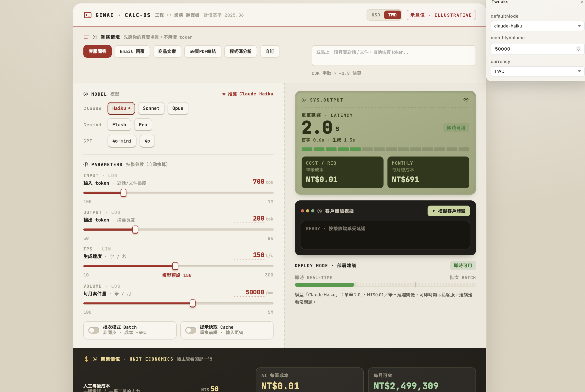

# Credit Decision Simulator & Risk Control Cutoff Optimization Tool
### 授信決策模擬器與風控模型閾值優化工具

一個專為金融科技（FinTech）與風險管理團隊設計的互動式量化模擬工具。本專案透過動態調整違約機率（PD）或信用評分之閾值（Cutoff），即時量化「一類錯誤（Type I Error）」與「二類錯誤（Type II Error）」對業務營收、預期損失（Expected Loss）、不良貸款率（NPL）以及淨利潤（Net Revenue）的實質財務影響，進而推導出最優化決策點。

## 🚀 線上互動展示 (Live Demo)
👉 [點擊此處直接線上操作模擬器](file:///Users/grecie/Downloads/風控模型閾值調整工具評析/授信決策index.html)

## 💡 核心商業與技術亮點
- **最優閾值自動推導 (Cutoff Optimization)**：系統內建利潤曲線，能自動計算出最大化淨利潤的黃金分割點（Optimum），協助風控人員平衡「錯殺好客」與「放進爛客」的財務成本。
- **即時混淆矩陣量化 (Confusion Matrix)**：隨著滑桿拖曳，即時計算並視覺化 True Positive, False Positive, True Negative, False Negative 的件數變化。
- **多維度風控指標動態監控**：即時輸出核貸率（Approval Rate）、NPL 佔比、預期損失（Expected Loss）等金融核心指標，並具備不良率超標之視覺化警示（NPL Alert）。
- **架構解耦設計**：將前端複雜的互動式 SVG 渲染與核心商業風控邏輯（`support.js`）完全解耦，具備高度的模組化與可擴充性。

## 📂 技術棧 (Tech Stack)
- **Frontend Core**: HTML5, CSS3, Vanilla JavaScript (部分採用高相容性 React UMD 運行時架構)
- **Visualization**: 動態 SVG 曲線繪製、即時利潤區域與混淆矩陣密度分布渲染。

## 📸 系統畫面截圖


## 🛠️ 如何在本機運行
1. 將此專案複製（Clone）到本地：
   ```bash
   git clone [https://github.com/你的帳號/credit-decision-simulator.git](https://github.com/你的帳號/credit-decision-simulator.git)